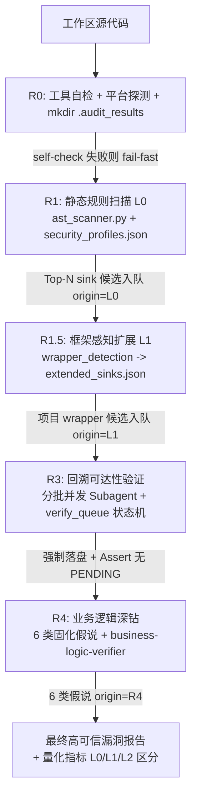

# Reachable Critical Audit Skill -- 系统设计文档 (System Design)

本文档描述了 `reachable-critical-audit` 技能 v2 的架构设计，并详细说明如何通过系统设计实现 REQUIREMENTS.md 中定义的每一项需求（REQ-01 至 REQ-20）。本版本相对 pre-v2 的核心架构改动：

1. **漏斗三阶段 → 五阶段**：新增 R0 工具自检、R1.5 框架感知扩展两个强制阶段。
2. **单一平台 → 双平台兼容层**：保留 Antigravity `define_subagent`/`agy`，新增 opencode `task` 降级。
3. **本仓库闭环 → 跨边界 sink 终结**：调用链到达 IPC/DSO/Provider 边界即可判定 sink，不再要求追溯外部实现。
4. **手写规则库 → CodeQL 清洗 + 项目 wrapper 双源**：`security_profiles.json` 必须源自 CodeQL qll，辅以 `wrapper_detection` 驱动的 L1 扩展。
5. **内存候选 → verify_queue 状态机**：候选必须落盘到 `.audit_results/verify_queue.json`，状态机驱动 R3/R4。

---

## 1. 软件设计哲学：双轨制 + 跨边界感知 + 规则可扩展

pre-v2 的设计哲学是"数据流/业务逻辑双轨制 + Grep 粗筛 + AST 校验 + Agent 语义回溯"。v2 在此基础上补齐三大盲区：

1. **跨边界 sink 不可见**：pre-v2 要求调用链在本仓库内闭环，导致 Android Bluetooth MAP 把恶意 `selection` 透传给外部 Email Provider 后无法判定 sink — 这是 framework 项目的通病。v2 引入 REQ-19 跨边界终结规则，**信任边界本身就是 sink**，与 OWASP taint propagation 标准对齐。
2. **项目 wrapper 不可见**：pre-v2 的 `security_profiles.json` 只列原生 sink（`strcpy`/`memcpy`/`query`），不覆盖项目自有 wrapper（Android BT 的 `osi_calloc`、`STREAM_TO_UINT16`、PHP 框架的 `DB\SQL::exec`）。v2 用 R1.5 阶段（REQ-18）显式识别 wrapper，并入候选队列。
3. **规则库盲区不可度量**：pre-v2 的 Coverage Rate 公式导致大项目采样时被扭曲（Bluetooth 报告 11% 被写成 100%）。v2 区分 L0/L1/L2 候选来源（REQ-10），用 Sink Discovery Rate 量化规则库召回能力。

因此 v2 的设计方案是 **"数据流/业务逻辑双轨分类 + 五阶段漏斗模型 + 跨边界 sink 终结 + CodeQL 双源规则库"**。

---

## 2. 系统架构与五阶段漏斗模型 (System Architecture)



### 2.1 五阶段定义

| 阶段 | 名称 | 输入 | 输出 | 守卫 |
| :--- | :--- | :--- | :--- | :--- |
| **R0** | 工具自检 + 平台探测 | 工作区路径 | `.audit_results/` 目录骨架 + `execution_mode.json` + `verify_queue.json` 空队列 | `ast_scanner.py --self-check` 失败即 fail-fast |
| **R1** | 静态规则扫描 (L0) | `security_profiles.json` + 工作区 | `verify_queue.json` 候选段（origin=L0） | AST 校验不通过的候选降级 NEEDS_REVIEW |
| **R1.5** | 框架感知扩展 (L1) | `wrapper_detection` + 工作区 | `extended_sinks.json` + 并入 `verify_queue.json`（origin=L1） | R1 命中为 0 且代码量超阈值时强制执行 |
| **R3** | 回溯可达性验证 | `verify_queue.json` PENDING 节点 | 每节点状态机推进到 REACHABLE/UNREACHABLE/NEEDS_REVIEW | 每批立即落盘 + Assert 无 PENDING 才能进 R4 |
| **R4** | 业务逻辑深钻 | `architecture_view.json` + 6 类假说 | `r4_findings` 段入 `verify_queue.json`（origin=R4） | 每假说必须明确结论（confirmed/reviewed_clean/not_applicable） |

### 2.2 漏洞分类处理模型 (Vulnerability Modeling)

pre-v2 的双轨制保留并强化：

*   **TAINT_ANALYSIS (污点分析)**：追踪外部 Source 到 Sink 的变量污染链。v2 新增 sink 类别：
    *   内存安全：CWE-789（未控内存分配，含 `*alloc(count*sizeof)` / `new[]` / `osi_*alloc`）、CWE-787（越界写）、CWE-125（越界读）、CWE-416/415（UAF/双释放，含 `delete`/`.reset()`/`base::Unretained`/`alarm_free`）、CWE-362（异步竞态，含 `Unretained(this)` + 队列）
    *   命令/代码执行：CWE-78/94（含 `system`/`popen`/`execve` + `eval`/`assert`）
    *   注入：CWE-89（含跨进程 ContentResolver.query selection 拼接）、CWE-22（路径穿越）、CWE-918（SSRF）
    *   反序列化：CWE-502（`unserialize`/`readObject`）
*   **PROPERTY_CHECK (属性与模式校验)**：v2 从粗关键字 (`admin`/`manage`/`delete`) 升级为 4 类结构化模式识别（详见 REQ-05）：
    *   `missing_owner_check`：写/删/查资源方法体内无 session vs owner 相等性比对
    *   `cross_boundary_trust_violation`：自由文本拼字符串传入跨进程 API 且参数化字段为 null
    *   `exported_no_permission`：manifest exported=true 且无 permission
    *   `privilege_boundary_skip`：提权前数据流入提权后指令

---

## 3. 平台兼容层 (Platform Adapter)

### 3.1 四种执行模式与降级矩阵

| 模式 | 平台 | 编排原语 | Subagent 类型 | 探测条件 |
| :--- | :--- | :--- | :--- | :--- |
| **Mode A** | Antigravity | `define_subagent` + `invoke_subagent` | `vulnerability-verifier` / `business-logic-verifier` / `framework-sink-extractor` | 工具列表含 `define_subagent` 或 `REACHABLE_AUDIT_MODE=native` |
| **Mode A'** | opencode 等 | `task(subagent_type="general"/"explore")` + `tools/batch_verify.py` 编排 | 通用子智能体 + batch 调度器（纯 Python，不依赖 `agy`） | 工具列表含 `task` 或 `OPENCODE=1`，或 Mode A 不可用 |
| **Mode A''** | Claude Code 等 | 主 Agent 单进程本地串行研判 (`grep_search`/`view_file`) | 无子智能体（主进程遍历 `verify_queue` 串行研判） | 既无 `define_subagent` 也无 `task` 工具，且 CLI 不可用 |
| **Mode B** | Antigravity CLI | `run_workflow.js` + `agy` spawn | 子进程 agy 会话 | `node run_workflow.js --check-availability` 返回 Mode B；ENOENT 返回 `AGENT_NATIVE_FALLBACK` 切回 Mode A' 或 Mode A'' |

### 3.2 执行模式自检流程

R0 阶段必须执行以下探测，结果写入 `.audit_results/execution_mode.json`：

```
1. if tool_list contains "define_subagent" or env.REACHABLE_AUDIT_MODE == "native":
       mode = "A_NATIVE_ANTIGRAVITY"
2. elif tool_list contains "task" or env.OPENCODE == "1":
       mode = "A_NATIVE_OPENCODE"
3. else:
       try:
           result = run("node run_workflow.js --check-availability")
           if result.mode == "B":
               mode = "B_ANTIGRAVITY_CLI"
           else:
               mode = "A_NATIVE_OPENCODE"  # fallback
       except:
           mode = "A_SINGLE_AGENT_FALLBACK"  # Mode A'' 兜底
4. write .audit_results/execution_mode.json = {mode, reason, detected_at}
```

### 3.3 子智能体角色与任务书标准化

为对齐三种模式下的子智能体行为，角色与任务书模板固化如下：

| 角色 | 职责 | Mode A 实现 | Mode A' 实现 | Mode B 实现 |
| :--- | :--- | :--- | :--- | :--- |
| `vulnerability-verifier` | 对单个候选 sink 自底向上可达性回溯 | `define_subagent + invoke_subagent` | `task(subagent_type="general", description="vulnerability-verifier: <id>", prompt=<任务书>)` | `agy --prompt <任务书>` |
| `business-logic-verifier` | 对单个业务假说做控制流/数据流断言比对 | 同上 | 同上 | 同上 |
| `framework-sink-extractor` | R1.5 阶段扫描项目自有 wrapper | 同上 | 同上 | 同上 |

**任务书模板（三种模式共用，写入 SKILL.md 附录）**：

```
你是一个 <role> 子智能体。

任务上下文:
- 目标项目: <path>
- 候选/假说 ID: <id>
- 候选 type: <sink_type / hypothesis_type>
- 上下文摘要: <5 行内的关键信息>

任务:
<具体可达性回溯 / 业务逻辑断言指令>

输出格式(强制 JSON):
{
  "id": "<id>",
  "verdict": "REACHABLE | UNREACHABLE | NEEDS_REVIEW",
  "reachability_type": "DIRECT | ACROSS_BOUNDARY",
  "call_chain": [<file:line>, ...],
  "blocking_point": "<file:line / null>",
  "evidence": "<一段说明>",
  "cwe": ["<CWE-...>"]
}
```

### 3.4 平台一致性强约束

无论何种模式，以下流程层必须一致，不允许因平台差异而省略：
- R0 工具自检 + `mkdir .audit_results/`
- `verify_queue.json` 强制落盘 + 状态机
- R1.5 强制触发条件（R1 命中 0 且代码量超阈值）
- R4 6 类固化假说
- REQ-10 量化公式分母为 L0+L1+R4 总和

---

## 4. CodeQL 双源规则库 (CodeQL-Sourced Rule Library)

### 4.1 规则库结构

`security_profiles.json` v2 结构：

```json
{
  "schema_version": "6.0",
  "codeql_revision": "codeql-v2.18.0",
  "rules": {
    "cpp": [...],
    "java": [...],
    ...
  },
  "wrapper_detection": {
    "cpp": {...},
    "java": {...},
    ...
  },
  "property_check_patterns": [...],
  "manual_additions": {
    "cpp": [...],
    "java": [...],
    ...
  }
}
```

### 4.2 CodeQL 清洗流程

由 `tools/codeql_sink_extractor.py` 完成，可重现：

| 语言 | CodeQL 路径 | 关键 qll 文件 / 提取路径 | 提取模式与 AST 支撑 |
| :--- | :--- | :--- | :--- |
| C++ | `cpp/ql/lib/semmle/code/cpp/security/` | `BufferAccess.qll` / `BufferWrite.qll` / `CommandExecution.qll` / `Overflow.qll` / `FileWrite.qll` | `hasGlobalName("...")` + 100% Tree-Sitter AST S-expr |
| Java | `java/ql/lib/semmle/code/java/security/` | `SQL.qll` / `Command.qll` / `Xss.qll` / `XML.qll` / `Dom/*.qll` | `getMethod("...")` + 100% Tree-Sitter AST S-expr |
| Python | `python/ql/lib/semmle/code/python/security/` | `SqlEvaluation.qll` / `Exec.qll` 等 | `getFunc("...")` + 100% Tree-Sitter AST S-expr |
| JS/TS | `javascript/ql/lib/semmle/code/javascript/security/` | `*Sink.qll` 系列 | `getCalleeName("...")` + 100% Tree-Sitter AST S-expr |
| Go | `go/ql/lib/semmle/code/go/security/` | `*Sink.qll` 系列 | `hasMemberName("...")` + 100% Tree-Sitter AST S-expr |
| C# | `csharp/ql/lib/semmle/code/csharp/security/` | `*Sink.qll` 系列 | `hasName("...")` + 100% Tree-Sitter AST S-expr |
| Rust | `rust/ql/lib/codeql/rust/security/` | `*Sink.qll` 系列 | `unsafe_block` / `hasName` + 100% AST S-expr |
| PHP | `php/ql/lib/semmle/code/php/security/` | `*Sink.qll` 系列 | `hasName("...")` + 100% Tree-Sitter AST S-expr |
| Ruby | `ruby/ql/lib/codeql/ruby/security/` | `*Sink.qll` 系列 | `hasName("...")` + 100% Tree-Sitter AST S-expr |
| Swift | `swift/ql/lib/codeql/swift/security/` | `*Sink.qll` 系列 | `hasName("...")` + 100% Tree-Sitter AST S-expr |
| Kotlin | `kotlin/ql/lib/codeql/kotlin/security/` | `*Sink.qll` 系列 | `hasName("...")` + 100% Tree-Sitter AST S-expr |
| Scala | `scala/ql/lib/codeql/scala/security/` (及 Java 通用) | `*Sink.qll` 系列 | `hasName("...")` + 100% Tree-Sitter AST S-expr |
| Shell | `shell/ql/lib/codeql/shell/security/` | Command/eval 提取模式 | `command_name` + 100% Tree-Sitter AST S-expr |
| Perl | `perl/ql/lib/codeql/perl/security/` | Sys/eval 提取模式 | `function_call` + 100% Tree-Sitter AST S-expr |
| PowerShell | `powershell/ql/lib/codeql/powershell/security/` | Invoke/cmd 提取模式 | `command_elements` + 100% Tree-Sitter AST S-expr |

清洗步骤：
1. `git clone https://github.com/github/codeql --depth 1 --branch <tag>` 固定版本
2. 对每个 `.qll` 按上表正则提取 sink/source 函数名
3. 按 CodeQL 目录结构（按 CWE 组织）归类
4. 输出到 `security_profiles.json` 对应语言段，写入 `codeql_revision` 字段
5. 手工补丁段（`manual_additions`）单独维护，标注来源理由与不在 CodeQL 中的原因

### 4.3 手工补丁段 (manual_additions)

CodeQL 不覆盖但必须纳入的 sink，单独列出：

| 语言 | sink | 来源理由 |
| :--- | :--- | :--- |
| C++ | `osi_calloc` / `osi_malloc` / `osi_free` / `osi_realloc` | Android Bluetooth 自有 allocator，CodeQL 不识别项目 wrapper |
| C++ | `STREAM_TO_UINT8/16/32` / `UINT*_TO_STREAM` / `BE_STREAM_TO_*` / `STREAM_TO_ARRAY` / `STREAM_SKIP_*` | Android Bluetooth 自有 packet 解析宏，作为 source 必须 taint |
| C++ | `base::Unretained` / `common::Unretained` | 异步回调持有裸指针，UAF 真正 source |
| C++ | `alarm_free` / `alarm_cancel` / `alarm_schedule` | Android Bluetooth alarm 生命周期 |
| Java | `ContentResolver.query` / `ContentResolver.notifyChange` | Android IPC SQL 接口，CodeQL Java SQL 模型不覆盖 ContentProvider |
| Java | `BluetoothMethodProxy.contentResolverQuery` | Bluetooth 框架自有代理 |
| Java | `SQLiteDatabase.query/rawQuery/execSQL` / `SQLiteQueryBuilder.query/buildQueryString` | Android SQLite 接口 |
| Java | `BluetoothMapAppParams.getFilterOriginator/getFilterRecipient` | Bluetooth MAP 远端可控 source |

### 4.4 wrapper_detection 字段

驱动 R1.5 阶段 LLM 识别项目自有 wrapper：

```json
"wrapper_detection": {
  "cpp": {
    "allocator_pattern": ["osi_*", "*alloc*", "*calloc*", "*_alloc_*"],
    "parser_macros":     ["STREAM_TO_*", "*_TO_STREAM", "BE_STREAM_TO_*"],
    "lifecycle":         ["*_delete", "*_cleanup", "*_destroy", "delete*", "*::reset", "*::release"],
    "async_ownership":   ["*::Unretained", "base::Unretained", "common::Unretained"]
  },
  "java": {
    "sql_wrappers":   ["*query*", "*Query*", "raw*", "*execSQL*"],
    "ipc_sinks":      ["ContentResolver.*", "Intent.*", "Bundle.*", "Uri.*"],
    "android_ipc_getter": ["getFilter*", "getExtra*", "getQueryParameter"]
  },
  ...
}
```

R1.5 阶段子智能体任务：扫描全项目，找出名字匹配以上模式的、本项目自定义的函数/宏/方法，产出 `extended_sinks.json`，并入 `verify_queue.json` 的候选段，`origin` 标记为 `L1`。

---

## 5. 需求实现深度映射 (Requirement to Design Mapping)

### REQ-01: 双平台原生 Subagent 拓扑编排
*   **设计实现**：
    *   安全审计依托平台原生智能体拓扑，由 REQ-17 平台兼容层决定具体执行模式。
    *   **Mode A (Antigravity)**：`define_subagent` 创建 `vulnerability-verifier`/`business-logic-verifier`/`framework-sink-extractor`，`invoke_subagent` 隔离执行。
    *   **Mode A' (opencode)**：`task(subagent_type="general"/"explore", description="<role>: <id>", prompt=<任务书>)` 承载角色。任务书模板见 §3.3。
    *   **Mode B (Antigravity CLI)**：[run_workflow.js](file:///root/reachable-critical-audit/run_workflow.js) + `agy` spawn 编排，ENOENT 自动降级到 Mode A'。
    *   三种模式共享同一任务书模板、同一 verify_queue 状态机、同一 R0/R1/R1.5/R3/R4 流程，行为一致。

### REQ-02: 语言层级 fallback (L0/L1/L2)
*   **设计实现**：
    *   **L0**：`security_profiles.json` `rules` 段，由 CodeQL 清洗产出，覆盖 15 种预设语言的 Top-N 高危 CWE。
    *   **L1**：`wrapper_detection` 段驱动 R1.5 阶段（REQ-18）扫描项目自有 wrapper，产出 `extended_sinks.json` 并入队。
    *   **L2**：非预设语言由 Agent 用内置安全知识生成 Top 10 高危漏洞映射，落盘 `.audit_results/extended_profile.json`，主 Agent 复核签名后才入队。
    *   `verify_queue.json` 每个候选 `origin` 字段标 L0/L1/L2/R4，供 REQ-10 公式区分。

### REQ-03: AST 物理工具强制 R0 self-check
*   **设计实现**：
    *   R0 阶段第一步：`python3 tools/ast_scanner.py --self-check`，确认 `tree-sitter` + 对应语言 grammar 可用。
    *   失败即 fail-fast 终止，**绝不降级为 LLM 脑补 AST**。
    *   R1 阶段每个 sink 候选必须经 `ast_scanner.py` 的 tree-sitter S-expression 校验，正则命中但 AST 校验不通过 → 降级 `NEEDS_REVIEW`。

### REQ-04: 物理过滤低危/规范与三方库噪音
*   **设计实现**：
    *   `ast_scanner.py` 过滤非调用类型关键字命中，忽略规范/风格/弱随机数噪点。
    *   检索算法绕过 `.min.` / `vendor/` / `node_modules/` / `third_party/` / `libs/` 等典型第三方路径。
    *   匹配行超 1000 字符强制截断 `... [TRUNCATED]`。

### REQ-05: 数据流污点与业务逻辑双轨审计
*   **设计实现**：
    *   TAINT_ANALYSIS：Source→Sink 污染链回溯，v2 sink 类别扩充见 §2.2。
    *   PROPERTY_CHECK：从粗关键字升级为 4 类模式识别（`missing_owner_check` / `cross_boundary_trust_violation` / `exported_no_permission` / `privilege_boundary_skip`），模式定义固化在 `security_profiles.json` 的 `property_check_patterns` 段。

### REQ-06: 双向调用链数据流追踪 + 跨边界终结
*   **设计实现**：
    *   子智能体以 sink 为终点，用 `grep` / `Grep` 工具反向查找调用者，逐层向上构建 `Sink <- Caller_L1 <- ... <- Source` 拓扑。
    *   遇接口/抽象类穿透到所有具体实现类继续回溯。
    *   遇跨进程 IPC / 跨 DSO / 跨 Provider authority 边界时，按 REQ-19 终结判定。

### REQ-07: 可达性条件过滤约束校验
*   **设计实现**：
    *   调用链中遇到强类型转换 / 白名单 / 参数化绑定 / `if (offset+N>p_pkt_end)` 显式边界检查 → 判定 `UNREACHABLE`，记录 `blocking_point` 入 `verify_queue.json`。

### REQ-08: 特权提升可利用性分析
*   **设计实现**：
    *   特权切换 Sink（`setuid`/`seteuid`/`setresuid`/`capng_*`/`prctl`）执行后，若指令参数仍混入低特权用户可控变量 → `REACHABLE`；完全硬编码 → `UNREACHABLE`。
    *   Android Bluetooth 守护进程（UID 1002）等系统服务同样适用：任何让该 UID 执行特权动作的远端输入按提权对待。

### REQ-09: verify_queue 状态机与断点硬校验
*   **设计实现**：
    *   `verify_queue.json` schema：
        ```json
        {
          "schema_version": "2.0",
          "candidates": [
            {
              "id": "CAND-001",
              "source_file": "...", "source_line": 123,
              "sink_type": "CWE-789", "source_pattern": "STREAM_TO_UINT16",
              "origin": "L0|L1|L2|R4",
              "status": "PENDING|VERIFIED",
              "verdict": "REACHABLE|UNREACHABLE|NEEDS_REVIEW",
              "reachability_type": "DIRECT|ACROSS_BOUNDARY",
              "call_chain": [...], "blocking_point": "...",
              "verified_at": "ISO8601"
            }
          ]
        }
        ```
     *   分批并发：每批 3~5 子智能体，单批完成立即落盘。Mode A' 使用 `tools/batch_verify.py`：
         - `--stage next`：输出下一批候选（含 task prompt），不修改队列状态
         - `--stage collect`：从 task 返回值更新队列，写回磁盘
         - `--stage assert`：检查无 PENDING 残留（exit 0=通过，exit 2=失败）
         - `--stage status`：打印队列进度摘要
     *   断点续传：二次启动跳过 `VERIFIED`。
     *   Assert 兜底：报告前必须 `batch_verify.py --stage assert` 通过；`NEEDS_REVIEW` 必须在报告显式列出。

### REQ-10: 审计漏斗量化度量 (L0/L1/L2 区分)
*   **设计实现**：
    *   在 `compileReport` 阶段提取 `verify_queue.json` 全部候选，按 `origin` 分类统计：
        *   `Rule Coverage Rate` = 已验证 / 总候选
        *   `Reachability Rate` = REACHABLE / 已验证
        *   `Noise Reduction Rate` = UNREACHABLE / 已验证
        *   `Sink Discovery Rate` = L0 命中 / 总候选（规则库召回能力）
        *   `False Negative Risk` = L1 占比 + R4 REACHABLE 占比（盲区指标）
    *   采样策略必须在报告中明示，`NEEDS_REVIEW` 计入分母。

### REQ-11: 声明式静态配置 + CodeQL 双源
*   **设计实现**：
    *   `security_profiles.json` 双源：CodeQL qll 清洗（L0）+ `manual_additions` 手工补丁。`codeql_revision` 字段记录所用版本。
    *   `wrapper_detection` 段驱动 R1.5 L1 扩展。
    *   详见 §4。

### REQ-12: 物理文件隔离前置守卫
*   **设计实现**：
    *   R0 阶段 `mkdir -p .audit_results/`，所有写入路径以 `.audit_results/` 为前缀。
    *   写文件前主 Agent 自检路径，违反即终止。

### REQ-13: 有向自主逻辑漏洞探索
*   **设计实现**：
    *   R3 完成后扫描高危业务模块（`auth`/`payment`/`order`/`admin`/`map`/`pbap`/`avrc` 等），上限 6 个文件。
    *   每模块拉起 `business-logic-verifier` 子智能体，模糊提示词发散威胁建模，结果落 `r4_findings` 段。

### REQ-14: 启发式项目架构与业务域自动感知
*   **设计实现**：
    *   Metadata Profiler 读 README/Manifest/Proto/AIDL 等，生成 `.audit_results/architecture_view.json` 供 R4 使用。

### REQ-15: 固化 6 类业务威胁假说
*   **设计实现**：
    *   R4 必须推演并回应 6 类固定假说：CWE-789 / CWE-125-787 / CWE-416-UAF / 跨进程 / 导出无权 / 越权-多租户。
    *   每假说三选一结论：`confirmed` / `reviewed_clean` / `not_applicable`，禁止默默跳过。
    *   假说清单固化在 SKILL.md，不由 Agent 自由推演。

### REQ-16: 业务逻辑专项 Subagent 并行深钻
*   **设计实现**：
    *   通过 REQ-01 编排机制拉起 `business-logic-verifier` 并发深钻 R4 锚点，结果落 `verify_queue.json` 的 `r4_findings` 段（origin=R4）。

### REQ-17: 平台兼容层与执行模式自检
*   **设计实现**：
    *   详见 §3。三种模式探测顺序：Antigravity Native → opencode task → agy CLI → fallback opencode。
    *   结果写入 `.audit_results/execution_mode.json`。

### REQ-18: 框架感知扩展 (R1.5 阶段)
*   **设计实现**：
    *   R1 完成后按 `wrapper_detection` 扫描项目自有 wrapper，产出 `extended_sinks.json`，`origin=L1` 并入 `verify_queue.json`。
    *   强制触发条件：R1 在主语言上命中 0 且项目源文件数 > 500 → R1.5 必须执行。
    *   pre-v2 两次漏报根因补救：MAP SQL 注入（`BluetoothMapContent.setWhereFilter*` wrapper 未识别）、AVRCP heap DoS（`osi_calloc` + `STREAM_TO_UINT16` 未识别）。

### REQ-19: 跨进程/跨 DSO 边界 sink 终结
*   **设计实现**：
    *   调用链到达 `ContentResolver.query` / `Binder.transact` / `Intent` extras / `broadcast` / 外部 DSO 函数 / 跨 Provider authority 时：
        *   自由文本参数（`selection`/`command`）含外部输入拼接 → `verdict=REACHABLE`, `reachability_type=ACROSS_BOUNDARY`
        *   参数化字段（`selectionArgs`/`args`）缺省为 null → 同上
        *   边界 API 强制参数化（`?` 占位 + 绑定） → 阻断，`UNREACHABLE`
    *   不要求追溯外部 Provider/DSO 实现。

### REQ-20: CodeQL 模型清洗工具与可重现更新
*   **设计实现**：
    *   [tools/codeql_sink_extractor.py](file:///root/reachable-critical-audit/tools/codeql_sink_extractor.py) 实现详见 §4.2。
    *   每次更新 `security_profiles.json` 必须更新 `codeql_revision` 字段。

---

## 6. 修订前后架构对比 (Architecture Diff)

| 维度 | pre-v2 | v2 |
| :--- | :--- | :--- |
| 漏斗阶段 | 三阶段（grep + AST + subagent） | 五阶段（R0 + R1 + R1.5 + R3 + R4） |
| 平台支持 | 单一 Antigravity `define_subagent`/`agy` | 双平台兼容层（Antigravity + opencode + agy 可选） |
| 规则库来源 | 手写 JSON | CodeQL 清洗 + `wrapper_detection` + `manual_additions` |
| sink 覆盖 | 缺 CWE-789/787/125, 无 `osi_*`/`STREAM_TO_*`/Android SQL | 全覆盖（CodeQL + 手工补丁） |
| 跨进程 sink | 要求本仓库闭环，framework 项目必漏报 | 边界即 sink，`REACHABLE_ACROSS_BOUNDARY` |
| ast_scanner.py | 形同虚设（从未被调用） | R0 强制 self-check，失败 fail-fast |
| verify_queue | 从未落盘 | 状态机驱动，强制落盘 + Assert |
| Coverage 公式 | 导致造假（11% 写成 100%） | L0/L1/L2 区分，Sink Discovery Rate 量化盲区 |
| 子智能体角色 | 散落各处调用点 | 固化 3 角色 + 任务书模板，三模式共用 |
| 假说推演 | 自由 3~5 个 | 固化 6 类必选，三选一结论 |
| REQ 数量 | 16 项 | 20 项（新增 REQ-17~20） |

---

## 7. 与既有代码的兼容性 (Backward Compatibility)

1. **`run_workflow.js` 不删除**：保留作为 Mode B（Antigravity CLI）执行路径，完善 ENOENT 降级返回结构化对象，顶部加注释"可选执行路径，Agent-Native 模式下不被调用"。
2. **`tools/ast_scanner.py` 不删除**：从"形同虚设"升级为 R0 强制工具，加 `--self-check` 子命令。
3. **`security_profiles.json` 全量重建**：保留 schema 向后兼容字段（`rules.<lang>.[]`），新增 `wrapper_detection` / `property_check_patterns` / `manual_additions` / `codeql_revision` 段。
4. **SKILL.md 阶段命名**：pre-v2 的"阶段 1/2/3/4"对应 v2 的"R1/R3/R3/R4"，R0 和 R1.5 为新增。文档中显式标注映射关系，避免历史引用断裂。
