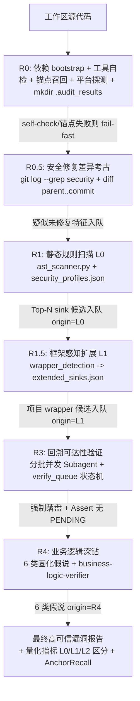

# Reachable Critical Audit Skill -- 系统设计文档 (System Design)

本文档描述了 `reachable-critical-audit` 技能 v2 的架构设计，并详细说明如何通过系统设计实现 REQUIREMENTS.md 中定义的每一项需求（REQ-01 至 REQ-23）。本版本相对 pre-v2 的核心架构改动：

1. **漏斗三阶段 → 五阶段**：新增 R0 工具自检、R1.5 框架感知扩展两个强制阶段。
2. **单一平台 → 双平台兼容层**：保留 Antigravity `define_subagent`/`agy`，新增 opencode `task` 降级。
3. **本仓库闭环 → 跨边界 sink 终结**：调用链到达 IPC/DSO/Provider 边界即可判定 sink，不再要求追溯外部实现。
4. **手写规则库 → CodeQL 清洗 + 项目 wrapper 双源**：`security_profiles.json` 必须源自 CodeQL qll，辅以 `wrapper_detection` 驱动的 L1 扩展。
5. **内存候选 → verify_queue 状态机**：候选必须落盘到 `.audit_results/verify_queue.json`，状态机驱动 R3/R4。

**v2.1 核心架构改动（由 phpMyAdmin LFI 漏检 + fastjson2 AutoType hash 绕过两次实测驱动）**：

6. **R0.5 安全修复差异考古（新阶段）**：利用 git 历史中安全修复 commit 的 diff 作为漏洞特征来源，定位"规则库无法表达的语义逻辑缺陷"（fastjson2 hash 白名单绕过只有版本对比才能确认）。
7. **锚点召回验证（新自检维度）**：`resources/anchor_registry.json` 固化每语言真实 CVE sink，self-check 强制 100% 命中，杜绝"覆盖率 100% 但核心攻击面零命中"的指标失真。
8. **LOGIC_PATTERN 危险谓词规则（第三类规则类型）**：表达"授权/白名单被弱化"的语义缺陷，不再依赖污点链。
9. **提取器完整性修复**：`semgrep_extractor.py` 支持 taint-mode 规则 + 增量合并 + `--reconcile` 对账，消除"官方有、skill 拉不进"的盲区。

---

## 1. 软件设计哲学：双轨制 + 跨边界感知 + 规则可扩展

pre-v2 的设计哲学是"数据流/业务逻辑双轨制 + Grep 粗筛 + AST 校验 + Agent 语义回溯"。v2 在此基础上补齐三大盲区：

1. **跨边界 sink 不可见**：pre-v2 要求调用链在本仓库内闭环，导致 Android Bluetooth MAP 把恶意 `selection` 透传给外部 Email Provider 后无法判定 sink — 这是 framework 项目的通病。v2 引入 REQ-19 跨边界终结规则，**信任边界本身就是 sink**，与 OWASP taint propagation 标准对齐。
2. **项目 wrapper 不可见**：pre-v2 的 `security_profiles.json` 只列原生 sink（`strcpy`/`memcpy`/`query`），不覆盖项目自有 wrapper（Android BT 的 `osi_calloc`、`STREAM_TO_UINT16`、PHP 框架的 `DB\SQL::exec`）。v2 用 R1.5 阶段（REQ-18）显式识别 wrapper，并入候选队列。
3. **规则库盲区不可度量**：pre-v2 的 Coverage Rate 公式导致大项目采样时被扭曲（Bluetooth 报告 11% 被写成 100%）。v2 区分 L0/L1/L2 候选来源（REQ-10），用 Sink Discovery Rate 量化规则库召回能力。

因此 v2 的设计方案是 **"数据流/业务逻辑双轨分类 + 五阶段漏斗模型 + 跨边界 sink 终结 + CodeQL 双源规则库"**。

---

## 2. 系统架构与五阶段漏斗模型 (System Architecture)



### 2.1 阶段定义

| 阶段 | 名称 | 输入 | 输出 | 守卫 |
| :--- | :--- | :--- | :--- | :--- |
| **R0** | 依赖 bootstrap + 工具自检 + 锚点召回 + 平台探测 | 工作区路径 | skill 安装目录 `.venv/`（必要时）+ 工作区 `.audit_results/` 目录骨架 + `execution_mode.json` + `verify_queue.json` 空队列 | tree-sitter/grammar 安装失败、`ast_scanner.py --self-check` 失败、或**锚点召回 < 100%** 即 fail-fast |
| **R0.5** | 安全修复差异考古（v2.1 新增） | 目标 repo + 指定 tag/commit | `.audit_results/r05_diff_archaeology.json`（疑似未修复特征清单 → 入 R3） | 无 git 历史则跳过并记录；有 git 历史必须执行 |
| **R1** | 静态规则扫描 (L0) | `security_profiles.json` + 工作区 | `verify_queue.json` 候选段（origin=L0） | AST 校验不通过的候选降级 NEEDS_REVIEW |
| **R1.5** | 框架感知扩展 (L1) | `wrapper_detection` + 工作区 | `extended_sinks.json` + 并入 `verify_queue.json`（origin=L1） | 始终执行，与 R1 互补不可替代 |
| **R3** | 回溯可达性验证 | `verify_queue.json` PENDING 节点 | 每节点状态机推进到 REACHABLE/UNREACHABLE/NEEDS_REVIEW | 每批立即落盘 + Assert 无 PENDING 才能进 R4 |
| **R4** | 业务逻辑深钻 | `architecture_view.json` + 6 类假说 | `r4_findings` 段入 `verify_queue.json`（origin=R4） | 每假说必须明确结论（confirmed/reviewed_clean/not_applicable） |

### 2.2 漏洞分类处理模型 (Vulnerability Modeling)

pre-v2 的双轨制保留并强化：

*   **TAINT_ANALYSIS (污点分析)**：追踪外部 Source 到 Sink 的变量污染链。v2 新增 sink 类别：
    *   内存安全：CWE-789（未控内存分配，含 `*alloc(count*sizeof)` / `new[]` / `osi_*alloc`）、CWE-787（越界写）、CWE-125（越界读）、CWE-416/415（UAF/双释放，含 `delete`/`.reset()`/`base::Unretained`/`alarm_free`）、CWE-362（异步竞态，含 `Unretained(this)` + 队列）
    *   命令/代码执行：CWE-78/94（含 `system`/`popen`/`execve` + `eval`/`assert`）
    *   注入：CWE-89（含跨进程 ContentResolver.query selection 拼接）、CWE-22（路径穿越）、CWE-918（SSRF）
    *   反序列化：CWE-502（`unserialize`/`readObject`）
*   **PROPERTY_CHECK (属性与模式校验)**：v2 从粗关键字 (`admin`/`manage`/`delete`) 升级为 4 类结构化模式识别（详见 REQ-05）：
    *   `missing_owner_check`：写/删/查资源方法体内无 session vs owner 相等性比对
    *   `cross_boundary_trust_violation`：自由文本拼字符串传入跨进程 API 且参数化字段为 null
    *   `exported_no_permission`：manifest exported=true 且无 permission
    *   `privilege_boundary_skip`：提权前数据流入提权后指令
*   **LOGIC_PATTERN (危险谓词模式)** *（v2.1 新增，第三类规则类型）*：匹配"授权/白名单/边界校验被弱化"的语义缺陷，不依赖污点链：
    *   hash-only 白名单：`Arrays.binarySearch(hashCodes, hash) >= 0` 后直接 `loadClass(typeName)` → fastjson2 `checkAutoType` 类
    *   远端计数无上限循环：远端 uint32 驱动 `for(i=0;i<count;i++)` 写入固定数组无 `count<=MAX` → tengine `parse_rc_info` 类
    *   前缀校验代替全名校验 / `expectClass==null` 分支跳过黑名单
    *   LOGIC_PATTERN 定义固化在 `security_profiles.json` 的 `rules.<lang>[]`（`type: "LOGIC_PATTERN"`），由 `ast_scanner.py` AST 匹配产出候选并入 R3。

---

## 3. 平台兼容层 (Platform Adapter)

### 3.1 四种执行模式与降级矩阵

| 模式 | 平台 | 编排原语 | Subagent 类型 | 探测条件 |
| :--- | :--- | :--- | :--- | :--- |
| **Mode A** | Antigravity | `define_subagent` + `invoke_subagent` | `vulnerability-verifier` / `business-logic-verifier` / `framework-sink-extractor` | 工具列表含 `define_subagent` 或 `REACHABLE_AUDIT_MODE=native` |
| **Mode A'** | opencode 等 | `task(subagent_type="general"/"explore")` + `tools/batch_verify.py` 编排 | 通用子智能体 + batch 调度器（纯 Python，不依赖 `agy`） | 工具列表含 `task` 或 `OPENCODE=1`，或 Mode A 不可用 |
| **Mode A''** | Claude Code 等 | 主 Agent 单进程本地串行研判 (`grep_search`/`view_file`) | 无子智能体（主进程遍历 `verify_queue` 串行研判） | 既无 `define_subagent` 也无 `task` 工具，且 CLI 不可用 |
| **Mode B** | CLI | `run_workflow.js` + `claude` / `agy` / `codex` spawn | 独立 CLI 子进程会话 | `node run_workflow.js --check-availability` 返回可用 CLI；ENOENT 返回 `AGENT_NATIVE_FALLBACK` 切回 Mode A' 或 Mode A'' |

### 3.2 执行模式自检流程

R0 阶段必须执行以下探测，结果写入 `.audit_results/execution_mode.json`：

```
1. if tool_list contains "define_subagent" or env.REACHABLE_AUDIT_MODE == "native":
       mode = "A_NATIVE_ANTIGRAVITY"
2. elif tool_list contains "task" or env.OPENCODE == "1":
       mode = "A_NATIVE_OPENCODE"
3. else:
       try:
           result = run("node run_workflow.js --check-availability")
           if result.mode == "B":
               mode = "B_ANTIGRAVITY_CLI"
           else:
               mode = "A_NATIVE_OPENCODE"  # fallback
       except:
           mode = "A_SINGLE_AGENT_FALLBACK"  # Mode A'' 兜底
4. write .audit_results/execution_mode.json = {mode, reason, detected_at}
```

### 3.3 子智能体角色与任务书标准化

为对齐三种模式下的子智能体行为，角色与任务书模板固化如下：

| 角色 | 职责 | Mode A 实现 | Mode A' 实现 | Mode B 实现 |
| :--- | :--- | :--- | :--- | :--- |
| `vulnerability-verifier` | 对单个候选 sink 自底向上可达性回溯 | `define_subagent + invoke_subagent` | `task(subagent_type="general", description="vulnerability-verifier: <id>", prompt=<任务书>)` | `agy --prompt <任务书>` |
| `business-logic-verifier` | 对单个业务假说做控制流/数据流断言比对 | 同上 | 同上 | 同上 |
| `framework-sink-extractor` | R1.5 阶段扫描项目自有 wrapper | 同上 | 同上 | 同上 |

**任务书模板（三种模式共用，写入 SKILL.md 附录）**：

```
你是一个 <role> 子智能体。

任务上下文:
- 目标项目: <path>
- 候选/假说 ID: <id>
- 候选 type: <sink_type / hypothesis_type>
- 上下文摘要: <5 行内的关键信息>

任务:
<具体可达性回溯 / 业务逻辑断言指令>

输出格式(强制 JSON):
{
  "id": "<id>",
  "verdict": "REACHABLE | UNREACHABLE | NEEDS_REVIEW",
  "reachability_type": "DIRECT | ACROSS_BOUNDARY",
  "call_chain": ["file:line:function", "file:line:function", "file:line:function", ...],
  "call_chain_depth": <int>,
  "blocking_point": "<file:line / null>",
  "path_count": <int>,
  "paths_analyzed": ["path1 description", ...],
  "evidence": "<一段说明>",
  "cwe": ["<CWE-...>"]
}
```

### 3.4 平台一致性强约束

无论何种模式，以下流程层必须一致，不允许因平台差异而省略：
- R0 依赖 bootstrap + 工具自检 + `mkdir .audit_results/`
- `verify_queue.json` 强制落盘 + 状态机
- R1.5 始终执行（无条件，与 R1 互补）
- R4 6 类固化假说
- REQ-10 量化公式分母为 L0+L1+L2+R4 总和

---

## 4. CodeQL 双源规则库 (CodeQL-Sourced Rule Library)

### 4.1 规则库结构

`security_profiles.json` v2 结构：

```json
{
  "schema_version": "6.0",
  "codeql_revision": "codeql-v2.18.0",
  "rules": {
    "cpp": [...],
    "java": [...],
    ...
  },
  "wrapper_detection": {
    "cpp": {...},
    "java": {...},
    ...
  },
  "property_check_patterns": [...],
  "manual_additions": {
    "cpp": [...],
    "java": [...],
    ...
  }
}
```

### 4.2 CodeQL 清洗流程

由 `tools/codeql_sink_extractor.py` 完成，可重现：

下表「扫描支撑」列表示该语言 L0 规则的机器可校验形式。self-check 覆盖率统计同时接受 `ast_patterns` 与结构化 CodeQL 模型（`go_models` / `swift_models`）。带 `source_reason` 且无 `codeql_model` 的 `manual_additions` 人工补丁单独计入 `manual_review_regex_rules`，不混入 CodeQL L0 覆盖率分母；Go/Swift 额外支持上下文匹配，避免 `Exec` / `Query` / `init` / `write` 等裸方法名造成高噪音命中。

| 语言 | CodeQL 路径 | 关键 qll 文件 / 提取路径 | 提取模式 | 扫描支撑 |
| :--- | :--- | :--- | :--- | :--- |
| C++ | `cpp/ql/lib/semmle/code/cpp/security/` | `BufferAccess.qll` / `BufferWrite.qll` / `CommandExecution.qll` / `Overflow.qll` / `FileWrite.qll` | `hasGlobalName("...")` | Tree-Sitter S-expr（已验证编译+命中） |
| Java | `java/ql/lib/semmle/code/java/security/` | `SQL.qll` / `Command.qll` / `Xss.qll` / `XML.qll` / `Dom/*.qll` | `getMethod("...")` | Tree-Sitter S-expr（已验证编译+命中） |
| Python | `python/ql/lib/semmle/code/python/security/` | `SqlEvaluation.qll` / `Exec.qll` 等 | `getFunc("...")` | Tree-Sitter S-expr（已验证编译+命中） |
| JS/TS | `javascript/ql/lib/semmle/code/javascript/security/` | `*Sink.qll` 系列 | `getCalleeName("...")` | Tree-Sitter S-expr（已验证编译+命中） |
| Go | `go/ql/lib/**/ext/*.model.yml` + security QLL | MaD `sinkModel` | `package/type/method/access_path/sink_kind` → `sinks.go_models[]` | 结构化上下文匹配；必须看到 import/package 证据 |
| C# | `csharp/ql/lib/semmle/code/csharp/security/` | `*Sink.qll` 系列 | `hasName("...")` | Tree-Sitter S-expr（已验证编译+命中） |
| Rust | `rust/ql/lib/codeql/rust/security/` | `*Sink.qll` 系列 | `unsafe_block` / `hasName` | Tree-Sitter S-expr（已验证编译+命中） |
| PHP | `php/ql/lib/semmle/code/php/security/` | `*Sink.qll` 系列 | `hasName("...")` | Tree-Sitter S-expr（已验证编译+命中） |
| Ruby | `ruby/ql/lib/codeql/ruby/security/` | `*Sink.qll` 系列 | `hasName("...")` | Tree-Sitter S-expr（已验证编译+命中） |
| Swift | `swift/ql/lib/codeql/swift/security/` | `*Extensions.qll` / `SqlInjectionExtensions.qll` | `SinkModelCsv` + `hasQualifiedName(...)` | 结构化类型/签名/参数标签匹配 → `sinks.swift_models[]` |
| Kotlin | `kotlin/ql/lib/codeql/kotlin/security/` | `*Sink.qll` 系列 | `hasName("...")` | Tree-Sitter S-expr（已验证编译+命中；节点类型 `call_expression`/`navigation_expression`，非 Java 节点） |
| Scala | `scala/ql/lib/codeql/scala/security/` (及 Java 通用) | `*Sink.qll` 系列 | `hasName("...")` | Tree-Sitter S-expr（已验证编译+命中；节点类型 `call_expression`/`field_expression`，非 Java 节点） |
| Shell | `shell/ql/lib/codeql/shell/security/` | Command/eval 提取模式 | `command_name` | 规则段暂空（无预置 sink 规则）；tree-sitter-bash 未随环境安装 → 运行时按 regex-only 降级 |
| Perl | `perl/ql/lib/codeql/perl/security/` | Sys/eval 提取模式 | `function_call` | 规则段暂空（无预置 sink 规则）；tree-sitter-perl 未随环境安装 → 运行时按 regex-only 降级 |
| PowerShell | `powershell/ql/lib/codeql/powershell/security/` | Invoke/cmd 提取模式 | `command_elements` | 规则段暂空（无预置 sink 规则）；tree-sitter 无 PowerShell grammar → regex-only |

> **诚实性说明**：Shell/Perl/PowerShell 目前 `rules` 段为空（无 CodeQL 清洗出的 sink），self-check 覆盖率统计不计入这三种语言的规则（分母为 0），故不影响 100% 结论；但这也意味着**这三种语言当前实际不产生 L0 候选**，命中依赖 R1.5 wrapper_detection 与 R4 业务假说。若要覆盖，需先在 `rules` 段补入规则并安装对应 grammar 包。

清洗步骤：
1. `git clone https://github.com/github/codeql --depth 1 --branch <tag>` 固定版本
2. 扫描 `.model.yml` `sinkModel`、旧式 `.qll` `hasName/hasQualifiedName`、Swift `SinkModelCsv`；`semgrep_extractor.py` 额外支持 `mode: taint` + `metavariable-regex` 的 `pattern-sinks`（如 PHP `file-inclusion.yaml` 的 `\b(include|include_once|require|require_once)\b`）
3. 按 CodeQL sink kind / CWE 归类
4. Go 写入 `sinks.go_models[]`，Swift 写入 `sinks.swift_models[]`，保留结构化上下文
5. 输出到 `security_profiles.json` 对应语言段，写入 `codeql_revision` 字段
6. 手工补丁段（`manual_additions`）单独维护，标注来源理由与不在 CodeQL 中的原因

**v2.1 提取器修复（REQ-27）**：
- **增量合并**：提取结果与既有规则/`manual_additions` 取**并集**，禁止覆盖式替换；`manual_additions` 段永远保留。
- **`--reconcile` 对账**：输出 `[官方有, skill 无]` / `[skill 有, 官方无]` 差异清单，供规则治理决策。
- **实测证据**：对账发现官方 `php/lang/security/file-inclusion.yaml`（CWE-98）从未进入 skill，且重跑 extractor 也补不回（提取逻辑跳过 taint-mode 规则 + 覆盖式合并抹掉既有 sink）。

Go/Swift 扫描策略：若规则包含结构化模型，`ast_scanner.py` 不执行该规则的裸 regex 初筛，而是要求上下文证据。Go 需要对应 import/package 证据；Swift 需要类型名、调用标签或明确 C API 函数名。保留在 JSON 中的 regex 只用于审计可读性和兼容，不作为高置信主路径。

### 4.2.1 AST S-expression 验证方法

每条 `ast_patterns` 在写入 `security_profiles.json` 前，必须通过以下双重验证，杜绝「pattern 写错节点类型名 → 运行时抛异常 → 整文件静默降级为正则」的隐患：

1. **编译验证**：用对应语言的 tree-sitter grammar 实例化 `Query(lang, pattern)`，不得抛 `QueryError`。此步捕获错误的节点类型名（如把 Java 的 `method_invocation` 误用到 Kotlin/Scala）、错误的字段名（如 C# 的 `Expression` 应为 `expression`）、不存在的语法结构。
2. **命中验证**：在一段包含目标 sink 的最小正样例代码上运行该 query，命中数必须 > 0。此步捕获「能编译但匹配不到真实代码」的空 pattern。

**约束**：任一验证失败的 pattern 一律不得写入。若某规则所有候选 pattern 均无法通过验证，则该规则保持 **regex-only**（移除 `ast_patterns` 字段），self-check 覆盖率如实下降，**绝不以编译失败的 pattern 充数覆盖率**。当前 12 种带 grammar 包的语言（C++/Java/Python/JS/Go/C#/Rust/PHP/Ruby/Swift/Kotlin/Scala）共 188 条 pattern 全部通过双重验证。

### 4.3 手工补丁段 (manual_additions)

CodeQL 不覆盖但必须纳入的 sink，单独列出：

| 语言 | sink | 来源理由 |
| :--- | :--- | :--- |
| C++ | `osi_calloc` / `osi_malloc` / `osi_free` / `osi_realloc` | Android Bluetooth 自有 allocator，CodeQL 不识别项目 wrapper |
| C++ | `STREAM_TO_UINT8/16/32` / `UINT*_TO_STREAM` / `BE_STREAM_TO_*` / `STREAM_TO_ARRAY` / `STREAM_SKIP_*` | Android Bluetooth 自有 packet 解析宏，作为 source 必须 taint |
| C++ | `base::Unretained` / `common::Unretained` | 异步回调持有裸指针，UAF 真正 source |
| C++ | `alarm_free` / `alarm_cancel` / `alarm_schedule` | Android Bluetooth alarm 生命周期 |
| Java | `ContentResolver.query` / `ContentResolver.notifyChange` | Android IPC SQL 接口，CodeQL Java SQL 模型不覆盖 ContentProvider |
| Java | `BluetoothMethodProxy.contentResolverQuery` | Bluetooth 框架自有代理 |
| Java | `SQLiteDatabase.query/rawQuery/execSQL` / `SQLiteQueryBuilder.query/buildQueryString` | Android SQLite 接口 |
| Java | `BluetoothMapAppParams.getFilterOriginator/getFilterRecipient` | Bluetooth MAP 远端可控 source |

### 4.4 wrapper_detection 字段

驱动 R1.5 阶段 LLM 识别项目自有 wrapper：

```json
"wrapper_detection": {
  "cpp": {
    "allocator_pattern": ["osi_*", "*alloc*", "*calloc*", "*_alloc_*"],
    "parser_macros":     ["STREAM_TO_*", "*_TO_STREAM", "BE_STREAM_TO_*"],
    "lifecycle":         ["*_delete", "*_cleanup", "*_destroy", "delete*", "*::reset", "*::release"],
    "async_ownership":   ["*::Unretained", "base::Unretained", "common::Unretained"]
  },
  "java": {
    "sql_wrappers":   ["*query*", "*Query*", "raw*", "*execSQL*"],
    "ipc_sinks":      ["ContentResolver.*", "Intent.*", "Bundle.*", "Uri.*"],
    "android_ipc_getter": ["getFilter*", "getExtra*", "getQueryParameter"]
  },
  ...
}
```

R1.5 阶段子智能体任务：扫描全项目，找出名字匹配以上模式的、本项目自定义的函数/宏/方法，产出 `extended_sinks.json`，并入 `verify_queue.json` 的候选段，`origin` 标记为 `L1`。

---

## 4.5 锚点召回注册表 (Anchor Registry) *（v2.1 新增，REQ-24）*

`resources/anchor_registry.json` 固化每语言 ground-truth CVE 攻击面锚点：

```json
{
  "schema_version": "1.0",
  "anchors": {
    "php": [
      {"cwe_id": "CWE-98", "category": "LocalFileInclusion",
       "sample_code": "<?php include $_GET['x']; ?>",
       "cve": "CVE-2018-12613"},
      {"cwe_id": "CWE-89", "category": "SqlInjection",
       "sample_code": "<?php $stmt = mysqli_query($conn, \"SELECT * FROM t WHERE id=$id\"); ?>",
       "cve": "CVE-2021-4048"}
    ],
    "java": [
      {"cwe_id": "CWE-502", "category": "Deserialization",
       "sample_code": "class A { public C f(String n){ return (C) Class.forName(n).newInstance(); } }",
       "cve": "fastjson2 checkAutoType hash-forge"},
      {"cwe_id": "CWE-78", "category": "CommandInjection",
       "sample_code": "class A { void f(String c){ Runtime.getRuntime().exec(c); } }",
       "cve": "CVE-2016-5734"}
    ]
  }
}
```

`ast_scanner.py --self-check` 对每个锚点运行命中测试，**AnchorRecall < 100% 该语言判 FAIL**（阻止审计启动）。锚点同时作为回归集：规则库任何改动后必跑，防止"修好 A 漏掉 B"。

## 4.6 R0.5 安全修复差异考古设计 *（v2.1 新增，REQ-25）*

```
R0.5 输入: 目标 repo 路径 + 指定 tag/commit
1. git log --grep="security|autotype|rce|bypass|cve|deny|fix|safe|exploit" --oneline
2. 对每个候选 commit:
     git diff <parent>..<commit> --stat
     提取特征: (a) 新增的校验/白名单/边界检查 (b) 被删除/弱化的危险路径
3. 对目标版本检查特征是否存在 → 输出 {commit, features, verdict: 疑似未修复/已修复}
4. 疑似未修复特征 → 直接入 R3 验证队列 (origin=R05)
产物: .audit_results/r05_diff_archaeology.json
```

设计动机（fastjson2 实测）：`checkAutoType` 的 hash 白名单绕过（2.0.63 修复 commit `ec47e24c4`）无法被任何 sink/污点规则表达，只有 diff 修复 commit 才能确认漏洞特征（"hash-only matching" → 应加文本校验）。R0.5 把"版本考古"固化为强制阶段，对 AutoType/RCE 这类迭代修复的库产出最高。无 git 历史时跳过并记录 `skipped_reason`。

---

## 5. 需求实现深度映射 (Requirement to Design Mapping)

### REQ-01: 双平台原生 Subagent 拓扑编排
*   **设计实现**：
    *   安全审计依托平台原生智能体拓扑，由 REQ-17 平台兼容层决定具体执行模式。
    *   **Mode A (Antigravity)**：`define_subagent` 创建 `vulnerability-verifier`/`business-logic-verifier`/`framework-sink-extractor`，`invoke_subagent` 隔离执行。
    *   **Mode A' (opencode)**：`task(subagent_type="general"/"explore", description="<role>: <id>", prompt=<任务书>)` 承载角色。任务书模板见 §3.3。
    *   **Mode B (CLI)**：`run_workflow.js` + `claude` / `agy` / `codex` spawn 编排，ENOENT 自动降级到 Mode A' 或 Mode A''。
    *   三种模式共享同一任务书模板、同一 verify_queue 状态机、同一 R0/R1/R1.5/R3/R4 流程，行为一致。

### REQ-02: 语言层级 fallback (L0/L1/L2)
*   **设计实现**：
    *   **L0**：`security_profiles.json` `rules` 段，由 CodeQL 清洗产出，覆盖 15 种预设语言的 Top-N 高危 CWE。
    *   **L1**：`wrapper_detection` 段驱动 R1.5 阶段（REQ-18）扫描项目自有 wrapper，产出 `extended_sinks.json` 并入队。
    *   **L2**：非预设语言由 Agent 基于 `security_profiles.json.l2_fallback_rules` 的 Top 10 高危规则生成漏洞映射，落盘 `.audit_results/extended_profile.json`，主 Agent 复核签名后才入队。Mode B 由 `run_workflow.js` 读取该配置，对非预设源码扩展执行保守通用高危模式扫描，写入 `reviewed_by: "main-agent"` 并以 `origin=L2` 入队。
    *   `verify_queue.json` 每个候选 `origin` 字段标 L0/L1/L2/R4，供 REQ-10 公式区分。

### REQ-03: AST 依赖 bootstrap + 物理工具强制 R0 self-check
*   **设计实现**：
    *   R0 阶段第一步：优先使用 skill 安装目录 `.venv/bin/python3`；该 `.venv` 不存在时由 `python3 -m venv <skill_dir>/.venv` 创建；self-check 报告缺 `tree-sitter` 或 grammar 时，在 skill-local `.venv` 内安装 `tree-sitter` 及 Java/C++/Python/JavaScript/Go/Rust/C#/PHP/Ruby/Swift/Kotlin/Scala grammar 包并重试一次。
    *   Mode B 中 `run_workflow.js` 通过 `ensureWorkflowPython()` 创建/选择 skill-local `.venv`，通过 `runAstSelfCheck()` 执行 self-check，失败后调用 `installTreeSitterDeps()` 安装依赖并重试；`REACHABLE_AUDIT_VENV` 可显式覆盖 venv 目录，`PYTHON_BIN` 显式设置时只使用该解释器，失败直接 fail-fast，避免污染系统 Python 或被审计项目 Python 环境。
    *   bootstrap 后运行 `<skill_dir>/.venv/bin/python3 tools/ast_scanner.py --self-check`（或 `PYTHON_BIN` 指定的 Python），确认 `tree-sitter` + 有规则语言的对应 grammar 可用。
    *   规则库加载失败、tree-sitter 缺失、任一有规则语言 grammar 缺失或 AST 覆盖率低于阈值时 fail-fast 终止，**绝不降级为 LLM 脑补 AST**。
    *   R1 阶段优先用 `ast_scanner.py` 的 tree-sitter S-expression 产生高置信候选，同时始终保留正则粗筛作为召回兜底；正则命中但缺乏 AST 校验支撑 → 降级 `NEEDS_REVIEW`。

### REQ-04: 物理过滤低危/规范与三方库噪音
*   **设计实现**：
    *   `ast_scanner.py` 过滤非调用类型关键字命中，忽略规范/风格/弱随机数噪点。
    *   检索算法绕过 `.min.` / 路径组件为 `vendor` / `node_modules` / `third_party` / `libs` / `.agents` / `.codex` / `.venv` / `reachable-critical-audit` 等典型第三方、工具和 skill 自身路径；路径过滤必须基于相对路径组件，不使用绝对路径子串匹配。
    *   匹配行超 1000 字符强制截断 `... [TRUNCATED]`。

### REQ-05: 数据流污点与业务逻辑双轨审计
*   **设计实现**：
    *   TAINT_ANALYSIS：Source→Sink 污染链回溯，v2 sink 类别扩充见 §2.2。
    *   PROPERTY_CHECK：从粗关键字升级为 4 类模式识别（`missing_owner_check` / `cross_boundary_trust_violation` / `exported_no_permission` / `privilege_boundary_skip`），模式定义固化在 `security_profiles.json` 的 `property_check_patterns` 段。

### REQ-06: 双向调用链数据流追踪 + 跨边界终结（语言无关）
*   **设计实现**：
    *   子智能体以 sink 为终点，用 `grep` / `Grep` 工具反向查找调用者，逐层向上构建 `Sink <- Caller_L1 <- Caller_L2 <- ... <- Source` 拓扑。
    *   **强制最小深度 3 层**：输出 `call_chain` 必须包含至少 Sink ← Caller_L1 ← Caller_L2，不足 3 层必须继续向上搜索。`batch_verify.py --stage collect` 自动验证必需字段与深度；缺字段保持 PENDING 重试，< 3 的 REACHABLE/UNREACHABLE 升级为 NEEDS_REVIEW。
    *   遇接口/抽象类/特征(trait)/虚函数穿透到所有具体实现类继续回溯。
    *   遇跨进程 IPC / 跨 DSO / 跨 Provider authority / 子进程执行 / 动态代码执行边界时，按 REQ-19 终结判定。

### REQ-07: 可达性条件过滤约束校验
*   **设计实现**：
    *   调用链中遇到强类型转换 / 白名单 / 参数化绑定 / `if (offset+N>p_pkt_end)` 显式边界检查 → 判定 `UNREACHABLE`，记录 `blocking_point` 入 `verify_queue.json`。

### REQ-08: 特权提升可利用性分析
*   **设计实现**：
    *   特权切换 Sink（`setuid`/`seteuid`/`setresuid`/`capng_*`/`prctl`）执行后，若指令参数仍混入低特权用户可控变量 → `REACHABLE`；完全硬编码 → `UNREACHABLE`。
    *   Android Bluetooth 守护进程（UID 1002）等系统服务同样适用：任何让该 UID 执行特权动作的远端输入按提权对待。

### REQ-09: verify_queue 状态机与断点硬校验
*   **设计实现**：
    *   `verify_queue.json` schema：
        ```json
        {
          "schema_version": "2.0",
          "candidates": [
            {
              "id": "CAND-001",
              "source_file": "...", "source_line": 123,
              "sink_type": "CWE-789", "source_pattern": "STREAM_TO_UINT16",
              "origin": "L0|L1|L2|R4",
              "status": "PENDING|VERIFIED",
              "verdict": "REACHABLE|UNREACHABLE|NEEDS_REVIEW",
              "reachability_type": "DIRECT|ACROSS_BOUNDARY",
              "call_chain": [...], "call_chain_depth": <int>,
              "blocking_point": "...", "path_count": <int>,
              "paths_analyzed": [...],
              "verified_at": "ISO8601"
            }
          ]
        }
        ```
     *   分批并发：每批 3~5 子智能体，单批完成立即落盘。Mode A' 使用 `tools/batch_verify.py`：
         - `--stage next`：输出下一批候选（含 task prompt），不修改队列状态
         - `--stage collect`：从 task 返回值更新队列，写回磁盘
         - `--stage assert`：检查无 PENDING 残留（exit 0=通过，exit 2=失败）
         - `--stage status`：打印队列进度摘要
     *   断点续传：二次启动跳过 `VERIFIED`。
     *   Assert 兜底：报告前必须 `batch_verify.py --stage assert` 通过；`NEEDS_REVIEW` 必须在报告显式列出。

### REQ-10: 审计漏斗量化度量 (L0/L1/L2 区分)
*   **设计实现**：
    *   在 `compileReport` 阶段提取 `verify_queue.json` 全部候选，按 `origin` 分类统计：
        *   `Rule Coverage Rate` = 已验证 / 总候选（L0+L1+L2+R4）
        *   `Reachability Rate` = REACHABLE / 已验证
        *   `Noise Reduction Rate` = UNREACHABLE / 已验证
        *   `Sink Discovery Rate` = L0 命中 / 总候选（规则库召回能力）
        *   `False Negative Risk` = L1 占比 + R4 REACHABLE 占比（盲区指标）
        *   `Anchor Recall` *(v2.1)* = 锚点命中数 / `anchor_registry.json` 锚点总数（规则库对真实 CVE 攻击面的召回）
    *   采样策略必须在报告中明示，`NEEDS_REVIEW` 计入分母。

### REQ-11: 声明式静态配置 + CodeQL 双源
*   **设计实现**：
    *   `security_profiles.json` 双源：CodeQL 模型清洗（L0，含 `.qll` / `.model.yml` / Swift `SinkModelCsv`）+ `manual_additions` 手工补丁。`codeql_revision` 字段记录所用版本。
    *   Go/Swift L0 规则保留结构化模型上下文（`go_models` / `swift_models`），扫描时按上下文命中，不把裸方法名当高置信 sink。
    *   `wrapper_detection` 段驱动 R1.5 L1 扩展。
    *   `l2_fallback_rules` 段驱动非预设语言 Top 10 高危兜底扫描，避免 fallback 规则散落在代码中。
    *   详见 §4。

### REQ-12: 物理文件隔离前置守卫
*   **设计实现**：
    *   R0 阶段 `mkdir -p .audit_results/`，所有写入路径以 `.audit_results/` 为前缀。
    *   写文件前主 Agent 自检路径，违反即终止。

### REQ-13: 有向自主逻辑漏洞探索
*   **设计实现**：
    *   R3 完成后扫描高危业务模块（`auth`/`payment`/`order`/`admin`/`map`/`pbap`/`avrc` 等），上限 6 个文件。
    *   每个固化假说拉起 `business-logic-verifier` 子智能体，结合最多 6 个高危锚点与全项目搜索做有向审查，结果落 `r4_findings` 段。

### REQ-14: 启发式项目架构与业务域自动感知
*   **设计实现**：
    *   Metadata Profiler 读 README/Manifest/Proto/AIDL 等，生成 `.audit_results/architecture_view.json` 供 R4 使用。

### REQ-15: 固化 6 类业务威胁假说
*   **设计实现**：
    *   R4 必须推演并回应 6 类固定假说：CWE-789 / CWE-125-787 / CWE-416-UAF / 跨进程 / 导出无权 / 越权-多租户。
    *   每假说三选一结论：`confirmed` / `reviewed_clean` / `not_applicable`，禁止默默跳过。
    *   假说清单固化在 SKILL.md，不由 Agent 自由推演。

### REQ-16: 业务逻辑专项 Subagent 并行深钻
*   **设计实现**：
    *   通过 REQ-01 编排机制拉起 `business-logic-verifier` 并发深钻 H1-H6 六个假说，结果落 `verify_queue.json` 的 `r4_findings` 段（origin=R4），并参与最终指标分母。

### REQ-17: 平台兼容层与执行模式自检
*   **设计实现**：
    *   详见 §3。三种模式探测顺序：Antigravity Native → opencode task → agy CLI → fallback opencode。
    *   结果写入 `.audit_results/execution_mode.json`。

### REQ-18: 框架感知扩展 (R1.5 阶段，始终执行)
*   **设计实现**：
    *   R1 完成后**无条件执行**。R1.5 与 R1 互补：R1 聚焦预设 L0 规则（CodeQL 清洗的函数签名），R1.5 通过 `wrapper_detection` 捕获项目自有 wrapper。两者覆盖不同的攻击面，不可互相替代。
    *   按 `wrapper_detection` 扫描项目自有 wrapper（覆盖全部 15 种预设语言），产出 `extended_sinks.json`，`origin=L1` 并入 `verify_queue.json`。
    *   即使 R1 在目标语言上命中率很高，R1.5 仍会捕获 L0 规则未覆盖的项目特有 wrapper（如 Android Bluetooth 的 `osi_*alloc`、`STREAM_TO_UINT*`、`ContentResolver.query` 自定义封装等）。
    *   pre-v2 两次漏报根因补救：MAP SQL 注入（`BluetoothMapContent.setWhereFilter*` wrapper 未识别）、AVRCP heap DoS（`osi_calloc` + `STREAM_TO_UINT16` 未识别）。

### REQ-19: 跨进程/跨 DSO 边界 sink 终结
*   **设计实现**：
    *   调用链到达 `ContentResolver.query` / `Binder.transact` / `Intent` extras / `broadcast` / 外部 DSO 函数 / 跨 Provider authority 时：
        *   自由文本参数（`selection`/`command`）含外部输入拼接 → `verdict=REACHABLE`, `reachability_type=ACROSS_BOUNDARY`
        *   参数化字段（`selectionArgs`/`args`）缺省为 null → 同上
        *   边界 API 强制参数化（`?` 占位 + 绑定） → 阻断，`UNREACHABLE`
    *   不要求追溯外部 Provider/DSO 实现。

### REQ-20: CodeQL 模型清洗工具与可重现更新
*   **设计实现**：
    *   `tools/codeql_sink_extractor.py` 实现详见 §4.2。
    *   支持 `--replace-langs go,swift` 这类单语言刷新，修复局部规则质量时不扰动其他语言。
    *   每次更新 `security_profiles.json` 必须更新 `codeql_revision` 字段。

### REQ-24: 锚点召回验证（AnchorRecall）
*   **设计实现**：`resources/anchor_registry.json`（§4.5）→ `ast_scanner.py --self-check` 跑锚点命中测试，< 100% fail-fast；报告 `quantified_metrics.anchor_recall_pct`。锚点即回归集。

### REQ-25: 安全修复差异考古（R0.5）
*   **设计实现**：§4.6。R0 通过后在 R1 前执行 `git log --grep=security` + `git diff parent..commit`，产出 `.audit_results/r05_diff_archaeology.json`，疑似未修复特征 origin=R05 入 R3。无 git 历史跳过并记录。

### REQ-26: LOGIC_PATTERN 危险谓词规则
*   **设计实现**：§2.2 第三类规则类型。`security_profiles.json` 的 `rules.<lang>[]` 中 `type: "LOGIC_PATTERN"` 条目由 `ast_scanner.py` AST 匹配，产出候选并入 R3。

### REQ-27: 提取器完整性修复与对账
*   **设计实现**：§4.2。`semgrep_extractor.py` 支持 taint-mode/metavariable-regex；合并改增量式（并集，保留 `manual_additions`）；新增 `--reconcile` 差异输出。

### REQ-28: 语言适配 sink 词表与上下文排除
*   **设计实现**：`security_profiles.json` 新增 `language_adaptation` 段：接收者排除表（Java `Runtime.exec` 限定 / 排除 ASM `Frame.execute`、javac `JCTree.exec`）+ 语言文件类型白名单（PHP 规则不扫 `.js`/`.py`）。`ast_scanner.py` 扫描时应用。

---

## 6. 修订前后架构对比 (Architecture Diff)

| 维度 | pre-v2 | v2 |
| :--- | :--- | :--- |
| 漏斗阶段 | 三阶段（grep + AST + subagent） | 五阶段（R0 + R1 + R1.5 + R3 + R4） |
| 平台支持 | 单一 Antigravity `define_subagent`/`agy` | 双平台兼容层（Antigravity + opencode + agy 可选） |
| 规则库来源 | 手写 JSON | CodeQL 清洗 + `wrapper_detection` + `manual_additions` |
| sink 覆盖 | 缺 CWE-789/787/125, 无 `osi_*`/`STREAM_TO_*`/Android SQL | 全覆盖（CodeQL + 手工补丁） |
| 跨进程 sink | 要求本仓库闭环，framework 项目必漏报 | 边界即 sink，`REACHABLE_ACROSS_BOUNDARY` |
| ast_scanner.py | 形同虚设（从未被调用） | R0 强制 self-check，失败 fail-fast |
| verify_queue | 从未落盘 | 状态机驱动，强制落盘 + Assert |
| Coverage 公式 | 导致造假（11% 写成 100%） | L0/L1/L2 区分，Sink Discovery Rate 量化盲区 |
| 子智能体角色 | 散落各处调用点 | 固化 3 角色 + 任务书模板，三模式共用 |
| 假说推演 | 自由 3~5 个 | 固化 6 类必选，三选一结论 |
| REQ 数量 | 16 项 | 20 项（新增 REQ-17~20） |
| R1.5 触发 | 条件触发（R1命中0且文件>500） | 始终执行（无条件） |
| R3 深度约束 | 无 | 强制 call_chain_depth >= 3，批量验证时自动检测 |
| 跨边界表 | 仅 Java IPC API | 语言无关，覆盖6种场景各语言示例 |
| 输出格式 | {call_chain, blocking_point} | {call_chain, call_chain_depth, path_count, paths_analyzed} |
| **v2.1: R0.5 阶段** | 不存在 | 安全修复差异考古（git diff 漏洞特征） |
| **v2.1: 锚点召回** | 覆盖率=字符串存在性 | AnchorRecall=真实 CVE 攻击面命中率，<100% fail-fast |
| **v2.1: 规则类型** | TAINT_ANALYSIS / PROPERTY_CHECK | + LOGIC_PATTERN（危险谓词） |
| **v2.1: 提取器** | 覆盖式合并、无 taint-mode 支持 | 增量合并 + taint-mode 提取 + `--reconcile` 对账 |

---

## 7. 与既有代码的兼容性 (Backward Compatibility)

1. **`run_workflow.js` 不删除**：保留作为 Mode B（Antigravity CLI）执行路径，完善 ENOENT 降级返回结构化对象，顶部加注释"可选执行路径，Agent-Native 模式下不被调用"。
2. **`tools/ast_scanner.py` 不删除**：从"形同虚设"升级为 R0 强制工具，加 `--self-check` 子命令。
3. **`security_profiles.json` 全量重建**：保留 schema 向后兼容字段（`rules.<lang>.[]`），新增 `wrapper_detection` / `property_check_patterns` / `manual_additions` / `codeql_revision` 段。
4. **SKILL.md 阶段命名**：pre-v2 的"阶段 1/2/3/4"对应 v2 的"R1/R3/R3/R4"，R0 和 R1.5 为新增。文档中显式标注映射关系，避免历史引用断裂。
