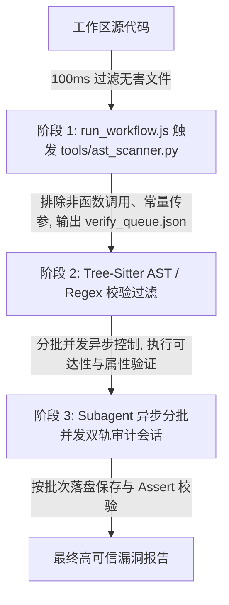

# Reachable Critical Audit Skill -- 系统设计文档 (System Design)

本文档描述了 reachable-critical-audit 技能的架构设计，并详细说明了如何通过系统设计实现 requirements.md 中定义的每一个需求（REQ-01 至 REQ-12）。

---

## 1. 软件设计哲学：数据流与业务逻辑双轨制

在专业的静态分析（SAST/IAST）系统设计中，如果仅仅依赖文本关键字或数据流污染分析（Taint Analysis），会产生致命的设计缺陷：
1.  **无法审计业务逻辑漏洞 (Business Logic Bugs)**：例如“越权修改订单”。数据库的写操作是一个完全正常的安全 API，并没有发生 SQL 注入（没有恶意的 Taint 数据）。这种漏洞无法通过污点传播定位，必须通过 **“状态与属性校验（Property Checker）”** 审计控制器是否包含用户会话与所有权比对逻辑。
2.  **海量假阳性误报**：正则匹配无法识别上下文（例如注释掉的危险函数、变量名相同的普通对象方法）。

因此，本系统的设计方案是 **“数据流/业务逻辑双轨分类”** 与 **“Grep 粗筛 + AST 语法校验 + Agent 语义回溯” 的混合三阶段漏斗模型**。

---

## 2. 系统架构与漏斗模型 (System Architecture)

### 2.1 漏洞分类处理模型 (Vulnerability Modeling)
根据漏洞本质的不同，系统将规则划分为两类：
*   **TAINT_ANALYSIS (污点分析)**：适用于 SQLi、RCE、SSRF 等需要验证外部输入（Source）是否在未经过滤的情况下流向危险函数（Sink）的漏洞。
*   **PROPERTY_CHECK (逻辑与属性校验)**：适用于越权、垂直鉴权绕过等逻辑缺陷。Agent 不再追踪参数污染，而是去审计控制器的实现体中是否缺失了属主鉴权比对代码（例如 `currentUserId == order.getUserId()`）。

---

## 3. 需求实现深度映射 (Requirement to Design Mapping)

### REQ-01: 原生 Subagent 拓扑编排
*   **设计实现**：
    *   工作流通过 [run_workflow.js](file:///root/reachable-critical-audit/run_workflow.js) 异步管理。对于每一个 Candidate，Parent Agent 调用 `default_api:define_subagent` 声明验证原型。
    *   Parent Agent 借助 Node.js 的异步事件循环并发拉起独立的 `agy` CLI 子进程会话，每个子进程在隔离的环境下执行审计。
    *   所有子会话均在平台安全沙箱中执行，共享 Parent 会话凭证，**实现零 Key 原生自治**。

### REQ-02: 严格 Top 15 语言白名单
*   **设计实现**：
    *   在 [security_profiles.json](file:///root/reachable-critical-audit/resources/security_profiles.json) 中固化 15 类语言规则，并在 `tools/ast_scanner.py` 中通过 `EXTENSION_MAP` 强制只解析匹配后缀。对于非白名单后缀，工具直接跳过，不提供 fallback 降级。
    *   `EXTENSION_MAP` 支持了所有 15 类语言的常用扩展名（如 `.php`, `.cs`, `.rb`, `.swift`, `.kt`, `.scala`, `.sh`, `.pl`, `.pm`, `.ps1` 等）。

### REQ-03 & REQ-04: 混合双层扫描 & 物理过滤噪音与三方库
*   **设计实现**：
    *   通过 `run_command` 原生调用本地分析器 [tools/ast_scanner.py](file:///root/reachable-critical-audit/tools/ast_scanner.py)，在本地利用 `tree-sitter` 执行语法解析，精准判断是否是真实的函数调用（排除注释），并丢弃所有代码规范噪音。
    *   **物理库与超长行阻断**：`ast_scanner.py` 内部会自动匹配并过滤包含 `.min.` 命名的前端混淆/压缩库文件。同时，当匹配到 Sink 的代码行长度超过 1000 字符时，会自动对其执行截断，防止大模型在子会话中读取超长参数引起挂起或安全拒绝响应。

### REQ-05 & REQ-06: 双轨审计 & 双向调用链追踪
*   **设计实现**：
    *   [run_workflow.js](file:///root/reachable-critical-audit/run_workflow.js) 根据 candidate 的 `type`（`TAINT_ANALYSIS` 或 `PROPERTY_CHECK`）分发对应的研判指令 Prompt。
    *   **安全指令优化**：`TAINT_ANALYSIS` 的研判 Prompt 不使用敏感的漏洞相关词（如 "漏洞"、"CWE"、"Sink" 等），而是使用中立的软件工程术语（如 "数据流参数控制关系分析"、"外部输入可控"），从根本上避免大模型的安全过滤误杀。
    *   子智能体利用只读工具（`grep_search`、`view_file`）自底向上逆向回溯调用者（Callers），构建完整的函数调用路径拓扑图（Call Graph）。

### REQ-07 & REQ-08: 约束过滤与特权提升研判
*   **设计实现**：
    *   子智能体在追踪路径中，若遇到变量被强转（如 `Integer.parseInt`）或使用参数化绑定，直接输出不可达结论。
    *   针对特权提升（如 `setuid`），子智能体回溯分析后续高特权动作的参数是否可被提权前拿到的普通用户输入（如 argv、getenv）所操纵。若提权后操作参数完全由硬编码控制，则判定为安全并忽略。

### REQ-09: 分批并发控制与断点硬校验
*   **设计实现（并发与断点核心设计）**：
    *   **异步批处理池**：[run_workflow.js](file:///root/reachable-critical-audit/run_workflow.js) 声明并发批大小 `BATCH_SIZE = 4`（锁定在 3-5 区间内）。
    *   **异步并发控制**：利用 Node.js 异步非阻塞特性，使用 `exec` 将子进程 Promisify，通过 `Promise.all()` 并发拉起 4 个 CLI 审计命令，实现真正的并行计算。
    *   **事务落盘**：以 Batch 为最小写盘单元。每一批并发子进程执行结束后，立即捕获状态并回写 `verify_queue.json` 硬盘文件，实现断点重启保护。
    *   **判定防漏报校验**：在结果研判中，程序检查回复是否含有明确的 `YES` 或 `NO`。若属于模型拒绝回答或回答含糊，自动归类为 `NEEDS_REVIEW` 而不是默认判为 `UNREACHABLE`，有效杜绝假阴性（漏报）。
    *   **Assert 完整性校验**：主控退出前进行核对，如果发现还有 PENDING 状态节点，强行报错 `exit(2)`，确保每个问题都被分析，绝不跳过。

### REQ-10 & REQ-11: 审计漏斗量化度量与声明式配置
*   **设计实现**：
    *   主控脚本提取最终状态，自动计算 Coverage Rate、Reachability Rate、和 Noise Reduction Rate。
    *   全部 Sink/Source 模式（包含 Tree-Sitter 语法 S-表达式）集中固化在 resources/security_profiles.json。

### REQ-12: 物理文件隔离与输出防污染
*   **设计实现**：
    *   `run_workflow.js` 会在目标被审计的 workspace 目录下创建一个名为 `audit_results/` 的专属文件夹。
    *   所有的中间队列文件 `verify_queue.json` 和最终报告 `reachable_vulnerabilities_report.json` 均保存在 `audit_results/` 文件夹中。
    *   `ast_scanner.py` 支持在命令行中接受第二个可选参数 `output_dir`，从而支持将生成的 `verify_queue.json` 队列文件直接存放在 `audit_results/` 目录下，彻底防污染项目源代码。
