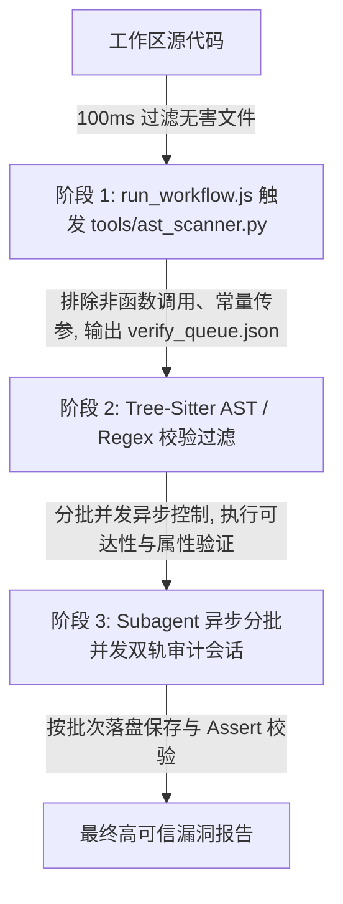

# Reachable Critical Audit Skill -- 系统设计文档 (System Design)

本文档描述了 reachable-critical-audit 技能的架构设计，并详细说明了如何通过系统设计实现 requirements.md 中定义的每一个需求（REQ-01 至 REQ-12）。

---

## 1. 软件设计哲学：数据流与业务逻辑双轨制

在专业的静态分析（SAST/IAST）系统设计中，如果仅仅依赖文本关键字或数据流污染分析（Taint Analysis），会产生致命的设计缺陷：
1.  **无法审计业务逻辑漏洞 (Business Logic Bugs)**：例如“越权修改订单”。数据库的写操作是一个完全正常的安全 API，并没有发生 SQL 注入（没有恶意的 Taint 数据）。这种漏洞无法通过污点传播定位，必须通过 **“状态与属性校验（Property Checker）”** 审计控制器是否包含用户会话与所有权比对逻辑。
2.  **海量假阳性误报**：正则匹配无法识别上下文（例如注释掉的危险函数、变量名相同的普通对象方法）。

因此，本系统的设计方案是 **“数据流/业务逻辑双轨分类”** 与 **“Grep 粗筛 + AST 语法校验 + Agent 语义回溯” 的混合三阶段漏斗模型**。

---

## 2. 系统架构与漏斗模型 (System Architecture)

### 2.1 漏洞分类处理模型 (Vulnerability Modeling)
根据漏洞本质的不同，系统将规则划分为两类：
*   **TAINT_ANALYSIS (污点分析)**：适用于 SQLi、RCE、SSRF 等需要验证外部输入（Source）是否在未经过滤的情况下流向危险函数（Sink）的漏洞。
*   **PROPERTY_CHECK (逻辑与属性校验)**：适用于越权、垂直鉴权绕过等逻辑缺陷。Agent 不再追踪参数污染，而是去审计控制器的实现体中是否缺失了属主鉴权比对代码（例如 `currentUserId == order.getUserId()`）。

---

## 3. 需求实现深度映射 (Requirement to Design Mapping)

### REQ-01: 原生 Subagent 拓扑编排
*   **设计实现**：
    *   安全审计完全基于原生的 `define_subagent` 与 `invoke_subagent` 动作。工作流由 [run_workflow.js](file:///root/reachable-critical-audit/run_workflow.js) 统一编排，创建并并发调用漏洞研判子智能体 `vulnerability-verifier`。
    *   子会话运行在受控的安全沙箱内，共享 Parent Agent 的会话授权和本地只读/写文件权限，完全避免在网络中传输、存储或暴露任何第三方的 API Key，保障审计过程的保密性与自给自足。

### REQ-02: 严格 Top 15 语言白名单
*   **设计实现**：
    *   系统在 [security_profiles.json](file:///root/reachable-critical-audit/resources/security_profiles.json) 中静态固化了且仅固化了 15 类开发语言的安全配置文件。
    *   在 [tools/ast_scanner.py](file:///root/reachable-critical-audit/tools/ast_scanner.py) 的 `EXTENSION_MAP` 中硬编码了这 15 类主流语言的扩展名后缀白名单（包括 `.java`, `.cpp`, `.py`, `.go`, `.rs`, `.js`, `.cs`, `.php`, `.rb`, `.swift`, `.kt`, `.scala`, `.sh`, `.pl`, `.ps1` 及其子后缀）。
    *   对于非白名单后缀，扫描器在遍历代码库时会直接进行物理跳过，明确不提供任何形式的动态降级或通用大模型盲测。

### REQ-03: 混合双层扫描 (AST 物理工具)
*   **设计实现**：
    *   系统在首阶段强制调用本地分析器 [tools/ast_scanner.py](file:///root/reachable-critical-audit/tools/ast_scanner.py) 开展静态初筛，防止直接利用大模型阅读源码产生的高延迟和理解幻觉。
    *   初筛采用两层过滤机制：先执行正则比对进行首层粗过滤，再自动调用本地 `tree-sitter` 执行精确的语法树 AST S-expression 语法比对校验。若本地环境的依赖项加载失败，流程直接终止退出，绝不提供模糊降级。

### REQ-04: 物理过滤低危/规范与三方库噪音
*   **设计实现**：
    *   **代码规范过滤**：在 `ast_scanner.py` 中过滤掉了非调用类型的关键字匹配，直接忽略与规范、风格、代码注释以及低危噪点（如非安全场景的弱随机数）相关的内容。
    *   **第三方库排除**：在检索算法中主动绕过包含 `.min.` 特征的第三方压缩/混淆依赖库文件，避开无关代码干扰。
    *   **超长行截断**：匹配出的代码行长度超过 1000 字符时强制切除并拼接 `... [TRUNCATED]`，彻底防止长提示词触发大模型输入过长或导致安全过滤保护响应。

### REQ-05: 数据流污点与业务逻辑双轨审计
*   **设计实现**：
    *   系统针对两类漏洞采取不同的处理指令和研判分支：
        *   **TAINT_ANALYSIS (污点分析)**：专门针对 SQL Injection、OS Command Injection、SSRF 等。研判 Prompt 使用非敏感的“数据流控制分析”代替安全词语以防屏蔽，促使模型严谨追踪 Source 到 Sink 的路径。
        *   **PROPERTY_CHECK (业务逻辑越权/属性校验)**：专门针对未授权/越权漏洞。Prompt 引导模型不要追踪数据流污染，而是定位方法体内是否缺失了当前会话登录者 ID 的属主校验代码逻辑。

### REQ-06: 双向调用链数据流追踪
*   **设计实现**：
    *   子智能体被分配漏洞验证任务后，以匹配到的敏感 Sink函数为回溯终点，在被审计项目的目录中使用 `grep_search` 反向寻找调用者。
    *   通过递归或逐级向上回溯（`Sink` <- `Caller_L1` <- `Caller_L2`），构建从 Sink 逆流而上到 Sources（如 HTTP 请求、Session 属性）的完整双向数据流链条。

### REQ-07: 可达性条件过滤约束校验
*   **设计实现**：
    *   子智能体在追踪数据流路径时，重点校验参数在其间是否发生了强类型转换（如强转为 `int`，或者使用 GUID 强匹配约束），或者经过了内置的白名单过滤、参数化查询等安全 Sanitizer 操作。
    *   一旦检测到无法穿透 of 阻断防御，模型必须判定为 `NO` (不可达)，对应的 Candidate 点立即作为误报被物理降噪并丢弃。

### REQ-08: 特权提升可利用性分析
*   **设计实现**：
    *   针对特权修改函数（如 `setuid`、`seteuid`），子智能体必须分析提权动作执行之后，后续的指令参数或文件操作数中，是否混入了提权前低特权外部用户的输入变量。
    *   如果在提权后，后续的危险动作或系统指令完全由硬编码控制，无任何用户可控性，判定为安全设计并标记为不可达（`UNREACHABLE`），防止产生误报。

### REQ-09: 分批并发控制与断点硬校验
*   **设计实现**：
    *   **并发控制**：在 [run_workflow.js](file:///root/reachable-critical-audit/run_workflow.js) 中，并发池大小限制在 `BATCH_SIZE = 4`（锁定在 3-5 区间），利用 Promise.all 异步拉起子进程校验。
    *   **断点落盘**：以 Batch 为单位执行。每一批完成，立即将当前状态持久化至磁盘文件 `verify_queue.json`，确保异常中断时能支持断点续传。
    *   **研判防漏**：程序校验子进程返回是否包含明确的 `YES` 或 `NO`。若被模型拒绝或回答含糊，自动定性为 `NEEDS_REVIEW`，杜绝漏报。
    *   **完整性 Assert**：流程结束前进行全面硬断言核对，如果存在任何仍处于 `PENDING` 的节点，主控直接报错 `exit(2)` 强制中断，保证无跳过。

### REQ-10: 审计漏斗量化度量
*   **设计实现**：
    *   在主控的 `compileReport` 函数中，系统提取整个审计队列中所有节点的状态分布（`REACHABLE`、`UNREACHABLE`、`NEEDS_REVIEW`）。
    *   根据标准公式自动计算并生成 **已执行回溯验证的比例（Rule Coverage Rate）**、**可达漏洞转化率（Reachability Success Rate）** 和 **静态误报降噪率（Noise Reduction Rate）** 并写入最终报告中。

### REQ-11: 声明式静态配置 (AST & Regex)
*   **设计实现**：
    *   开发语言的分类配置、CWE 映射、Source/Sink 检测正则及 AST S-expressions 声明，完全集中存放于外部 of 声明式 JSON 文件 [security_profiles.json](file:///root/reachable-critical-audit/resources/security_profiles.json) 中。
    *   主逻辑与具体的规则内容彻底解耦，系统通过动态解析 JSON 文件自动加载相应规则，无需在代码中硬编码任何审计策略。

### REQ-12: 物理文件隔离与输出防污染
*   **设计实现**：
    *   在工作流启动后，主控脚本自动在被审计的目标工程根目录下创建一个名为 `.audit_results/` 的专属隐藏文件夹。
    *   审计过程中的中间产物 `verify_queue.json` 以及最终的漏洞量化报告 `reachable_vulnerabilities_report.json` 将会被全部限制在此隐藏文件夹内生成和更新，严格保障审计项目的源代码树免遭任何文件写入污染。
